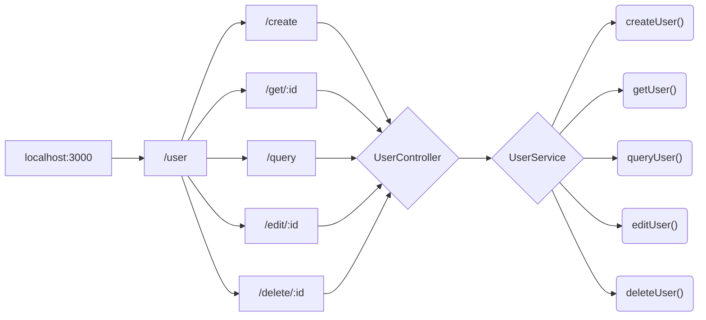
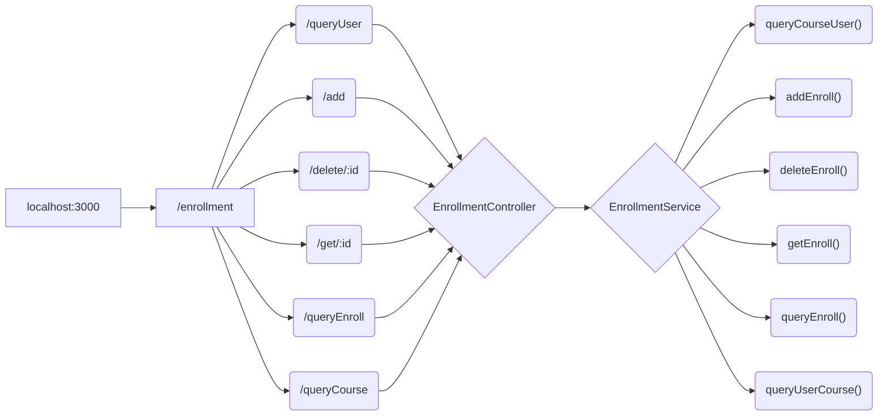
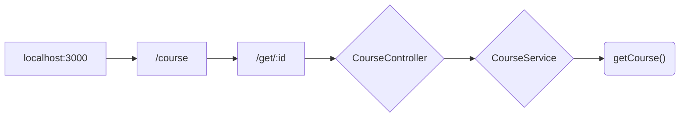

# NTUCool-Interview

## Directories & Files
### User
- contain module related to users
- dto directory kept format for how the data sent over the network

### Course
- contain module related to courses

### Enrollment
- contain module related to enrollments
- dto directory kept format for how the data sent over the network

### Auth
- contain functions related to authentication of admin 'cool'

### Database
- contain the initData for Restful API
- contain the schema(type) for User, Course and Enrollment

### Utility
- contain helper functions to assist usage of Restful API

## Restful API
### User

- **".../user/create"**
    - **ReqMethod: POST**
    - **create new user**
    - **requirement:** 
        -  In Header: {Authorization: Bearer {token} }
        -  In Body: { "name": {string}, "email": {string} }
    - **response:**
        - success 
            - User {name} created!
        - invalid email
            - BadRequestException("str must match \^[\\S]+@[\\S]+$ regular expression");
        - duplicate users
            - BadRequestException("Name or Email already been used!");
        - invalid token
            - UnauthorizedException();
            
- **".../user/get/:id"**
    - **ReqMethod: GET**
    - **get user data by id**
    - **requirement:**
        - id should replace with valid target user's id 
    - **response:**
        - success
            - user's data
        - invalid id
            - BadRequestException("Invalid id! User not exists!");
            
- **".../user/query?filter={string}&str={string}"**
    - **ReqMethod: GET**
    - **query user by name/email**
    - **use filter to specified content of str (name / email), str contain query parameter**
    - **requirement:**
        - In Query: { "filter": {"name" or "email"}, "str": {string} }
    - **response:**
        - success
            - user's data
        - invalid email
            - BadRequestException("str must match "\^[\\S]+@[\\S]+$" regular expression")
        - invalid filter
            - BadRequestException("Invalid filter!");
        - invalid str
            - BadRequestException("Invalid name! User not exists!");
            - BadRequestException("Invalid email! User not exists!");
            
- **".../user/edit/:id"**
    - **ReqMethod: PUT**
    - **edit user name and email by id**
    - **content in name or email can be blank => no changes**
    - **requirement:**
        - id should replace with valid target user's id 
        - In Header: {Authorization: Bearer {token} }
        - In Body: { "name": {string}, "email": {string} }
    - **response:**
        -  success
            -  User with id {id} edited!
        -  invalid id
            -  BadRequestException("Invalid id! User not exists!");
        -  invalid token
            -  UnauthorizedException();
         - invalid email
            -  BadRequestException("str must match "\^[\\S]+@[\\S]+$" regular expression")
            
- **".../user/delete/:id"**
    - **ReqMethod: DELETE**
    - **delete user by id**
    - **requirement:**
        - id should replace with valid target user's id 
        - In Header: {Authorization: Bearer {token} }
    - **response:**
        -  success
            -  User with id ${id} deleted!
        -  invalid id
            -  BadRequestException("Invalid id! User not exists!");
        -  invalid token
            -  UnauthorizedException();
---
### Enrollment

- **".../enrollment/queryUser?courseId={number}"**
    - **ReqMethod: GET**
    - **query user data by courseId**
    - **requirement:**
        - In Query: { "courseId": {number} }
    - **response:**
        - success
            - users data
        - invalid courseId
            - BadRequestException("Invalid id! Course not exists!")

- **".../enrollment/add"**
    - **ReqMethod: POST**
    - **add enrollment with given userId, courseId and role**
    - **requirement:**
        - In Header: {Authorization: Bearer {token} }
        - In Body: {"userId": {number}, "courseId": {number}, "role": {"student" or "teacher"} }
    - **response:**
        - success
            - New Enrollment added!
        - invalid userId
            - BadRequestException("Invalid userId!");
        - invalid courseId
            - BadRequestException("Invalid courseId!");
        - invalid role
            - BadRequestException("Invalid role!");
        - duplicate enrollment
            - BadRequestException("Enrollment Existed!");
        - invalid token
            - UnauthorizedException()

- **".../enrollment/delete/:id"**
    - **ReqMethod: DELETE**
    - **delete enrollment by id**
    - **requirement:**
        - :id must replace by the id of target enrollment
        - In Header: {Authorization: Bearer {token} }
    - **response:**
        - success
            - Enrollment with id {id} deleted!
        - invalid id 
            - BadRequestException("Invalid id! Enrollment not exists!");
        - invalid token
            - UnauthorizedException();

- **".../enrollment/get/:id"**
    - **ReqMethod: GET**
    - **get enrollment data by id**
    - **requirement:**
        - :id must replace by the id of target enrollment
    - **response:**
        - success
            - enrollment's data
        - invalid id
            - BadRequestException("Invalid id! Enrollment not exists!");

- **".../enrollment/queryEnroll?userId={number}&courseId={number}&role={string}"**
    - **ReqMethod: GET**
    - **query enrollment by userId, courseId or role**
    - **content in userId, courseId or role can be blank => not used as query parameter**
    - **requirement:**
        - In Query: { "userId": {number}, "courseId": {number}, "role": {"student" or "teacher"} }
    - **response:**
        - success
            - enrollments's data
        - invalid userId
            - BadRequestException("Invalid id! User not exists!");
        - invalid courseId
            - BadRequestException("Invalid id! Course not exists!");
        - invalid role
            - BadRequestException("Invalid role!");

- **".../enrollment/queryCourse?userId={number}"**
    - **ReqMethod: GET**
    - **query course data by userId**
    - **requirement:**
        - In Query: { "userId": {number} }
    - **response:**
        -  - success
            - enrollments's data
        - invalid userId
            - BadRequestException("Invalid id! User not exists!");
---
### Course

- **".../course/get/:id"**
    - **ReqMethod: GET**
    - **get course data by id**
    - **requirement:**
        - id should replace with valid target course's id 
    - **response:**
        - success
            - course's data
        - invalid id
            - BadRequestException("Invalid id! Course not exists!");

## Some Implementations
- email must match regex \/^\S@\S$\/
    - using ValidationPipe to verify the format of email
    - @Matches('\^[\\S]+@[\\S]+$') 
    
- return BadRequest 
    - `throw new BadRequestException({msg});`

- Bearer Auth token Header, token = 'cool'
    - carry Bearer auth token in the header of html request 
    - In Header: {Athorization: Bearer 'cool'}
    - extract auth token by 
        - `BearerToken = headers.authorization.split(' ');`
        - should get `BearerToken[0] === 'Bearer' && BearerToken[1] === 'cool'`

- return Unauthorized
    -  `throw new UnauthorizedException();`
