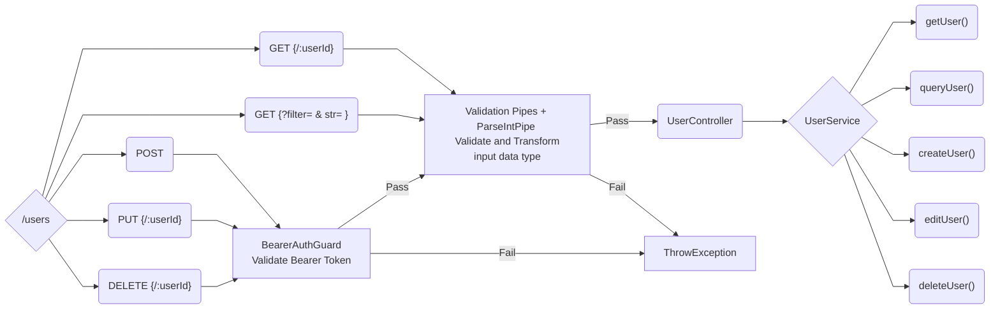
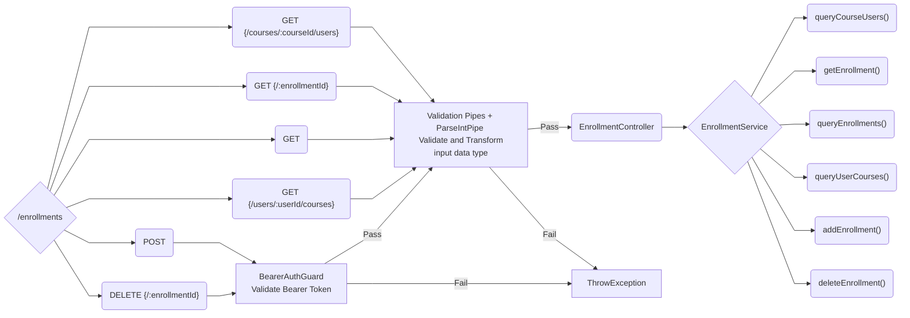
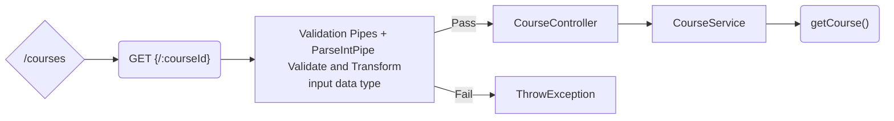

# NTUCool-Interview

## Preparation and Installation
- install nest.js using `npm install -g @nestjs/cli`
- install the required modules through `npm install`
- run the Web API with `npm run start`
- test the Web API through API tester like Postman(https://www.postman.com/), Insomnia(https://insomnia.rest/) 

## Directories & Files
### User 
- contain module, controller and service related to users

### Course
- contain module, controller and service related to courses

### Enrollment
- contain module, controller and service related to enrollments

### Database
- contain the initData for Restful API
- contain the schema(type) for Users, Courses and Enrollments

### Dto
- dto directory kept format for how the data sent over the network

## Restful API
### User API


- create User: **POST**`.../users`
- get User: **GET**`.../users/:userId`
- query User: **GET**`.../users?filter= & str=`
- edit User: **PUT**`.../users/:userId`
- delete User: **DELETE**`.../users/:userId`

### Enrollment API

- query Course Users: **GET** `.../enrollments/courses/:courseId/users`
- add Ennrollment: **POST**`.../enrollments`
- delete Enrollment: **DELETE**`.../enrollments/:enrollmentId`
- get Enrollment: **GET**`.../enrollments/:enrollmentId`
- query Enrollments: **GET**`..../enrollments?userId= &courseId= &role= `
- query User Courses: **GET**`.../enrollments/users/:userId/courses`
### Course API

- get Courses: **GET**`.../courses/:courseId`

### Swagger 
- `localhost:3000/api`
- 

## Some Implementations and Fix
### email must match regex \/^\S@\S$\/
- using ValidationPipe to verify the format of email
- `@Matches('\^[\\S]+@[\\S]+$') `
    
### return BadRequest 
- `throw new BadRequestException({ErrMsg});`

### Bearer Auth token Header, token = 'cool'
- use BearerAuthGuard to validate Bearer Token
- carry Bearer Token in the header of html request 
    - In Header: {Athorization: Bearer 'cool'}
    - extract auth token by 
        - `bearerToken = req.headers['authorization'].split(' ');`
        - should get 
            - `bearerToken.length === 2`
            - `bearerToken[0] === 'Bearer' && bearerToken[1] === 'cool'`

### return Unauthorized
-  `throw new UnauthorizedException();`

### Restful API issue
- remove unecessary verbs in url path 
- new API stated above 

### userId issue
- previously using users[] array index as userId
    - loss the unique property of userId
- solution
    - declare a `private id = 5` variable, update after each user creation
        - allow to maintain unique userId and used as increment id
        ```
                this.users.push({
                  id: this.id++,
                  name: username,
                  email: email,
                });
        ```

### courseId issue
- previously start at 1, now start at 0 
- total of 5 entries according to dataset provided

### isValidId modification
- previously differ in User, Enrollment and Course due to different id range
- utilise arr.some(), user's isValidId as example: 
    ```
    isValidId(userId: number): boolean {
        return this.users.some((obj) => obj.id === Number(userId));
      }
    ``` 
    
### replace middleware to guards
- create `bearer-auth.guard.ts`
- fix `bearerToken[1]` might cause internal server error problem
    - check before access 
    ```
         if (bearerToken.length !== 2)
            throw new BadRequestException('Invalid Bearer Token!');
    ```
- bind guard with decorator `useGuards(BearerAuthGuard)`

### coding style issue 
- rename files name
- rename variables, functions, classes name using camelCase and PascalCase
- implement prettier and eslint to help adjusting code structure
-  references: 
    -  https://angular.io/guide/styleguide 
    -  https://google.github.io/styleguide/tsguide.html

### git commit issue
- using `git rebase` to merge unnecessary commit
